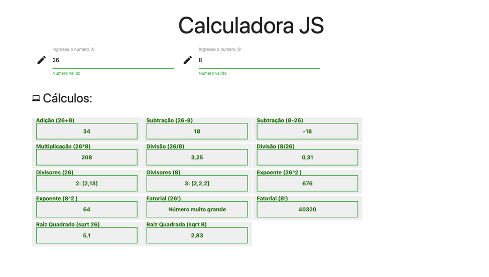

# CalculadoraJS

Calculadora is a single page that perform calculations using 'pure' JavaScript.

## Installation

Use the following npm commands. Which will install the dependencies and start the live-server

```bash
npm install
```

CalculadoraJS can use the live-server too

```bash
npm start
```

## Usage

Enter 2 Numbers (A, B) inside the inputs and CalculadoraJS will perform the following calculations:

- Addition: A + B
- Subtraction: A - B
- Subtraction: B - A
- Multiplication: A \* B
- Division: A/B `will return "Divisão por 0" if B === 0`
- Division: B/A `will return "Divisão por 0" if A === 0`
- Exponent: A²
- Exponent: B²
- Square root: √A
- Square root: √B
- Divisors: A `will return the quantity and an array of the divisors of A`
- Divisors: B `will return the quantity and an array of the divisors of B`
- Factorial: A! `will return 'Número muito grande' if A is > 21`
- Factorial: B! `will return 'Número muito grande' if B is > 21`

> Note: The decimals in the results are rounded to 2 digits "ToFixed(2)"

## Technology

HTML, JavaScript

## Contributing

Pull requests are welcome. For major changes, please open an issue first to discuss what you would like to change.

##

This is a practice for the [IGTI bootcamp](https://www.igti.com.br/). "Fundamentos Bootcamp de Desenvolvimento Front End" 2020


## License

[MIT](https://choosealicense.com/licenses/mit/)
